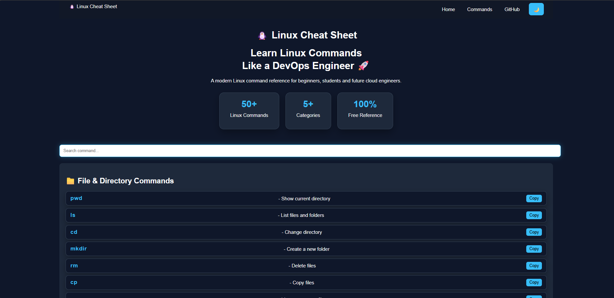

# 🐧 Linux Cheat Sheet | Git | Docker


A modern command reference for **Linux, Git, and Docker**, designed for beginners, students, and aspiring **Cloud & DevOps Engineers**.

---


## 🚀 Features

* 📁 50+ Linux commands
* 📂 Detailed Git commands with explanations
* 🐳 Essential Docker commands with examples
* 🔍 Live command search
* 📋 One-click Copy button
* 🌙 Dark / Light mode
* 📱 Responsive design
* 🎨 Modern UI with interactive cards

---

## 🛠️ Tech Stack

* HTML5
* CSS3
* JavaScript (Vanilla)

---

## 📸 Preview

### 🏠 Home Page




---

## 📂 Project Structure

```text
linux-cheat-sheet/
│
├── index.html
├── style.css
├── script.js
├── README.md
│
└── Screenshots/
    └── linux-cheat-sheet-home.png
```

---

## 💻 How to Run

1. Clone the repository

```bash
git clone https://github.com/arunvishwakarma1307-wq/linux-cheat-sheet.git
```

2. Open the project folder.

3. Double-click `index.html`

or

Open the project in **Visual Studio Code** and run it using **Live Server**.

---

## 📚 Included Command Categories

* 📁 File & Directory Commands
* 👤 User Commands
* 🌐 Network Commands
* ⚙️ Process Commands
* 💾 Disk Commands
* 📂 Git Commands
* 🐳 Docker Commands
* 🖥️ System Commands

---

## 🎯 Purpose

This project was created to help beginners learn the most commonly used Linux, Git, and Docker commands through a clean and easy-to-use interface.

It also serves as a portfolio project demonstrating Linux, Git, Docker, and front-end development skills for Cloud and DevOps learning.

---

## 🚀 Future Improvements

* ☸️ Kubernetes Commands
* ☁️ AWS CLI Commands
* 🎨 Advanced Search with Highlight
* ⭐ Favorite Commands
* 📱 Improved Mobile Experience
* 📄 Command Cheat Sheet PDF Export
* ⚙️ DevOps Tools (Terraform, Jenkins, Ansible)
---

## 👨‍💻 Author

**Arun Vishwakarma**

* GitHub: https://github.com/arunvishwakarma1307-wq
* LinkedIn: https://www.linkedin.com/in/arun-vishwakarma-9a25543b3

---

## ⭐ Support

If you found this project helpful, please consider giving it a ⭐ on GitHub.
